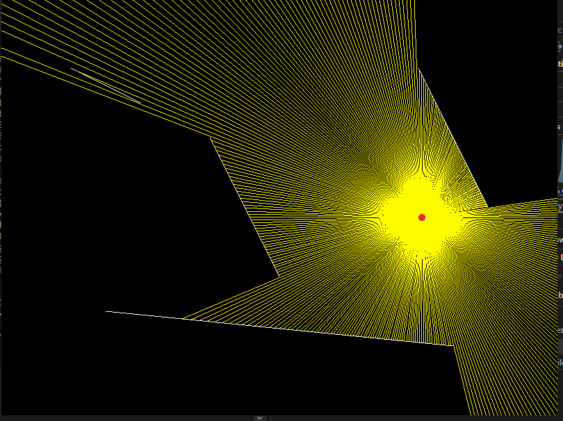

# Raycasting Simulation

This project demonstrates a **raycasting simulation** in C++ using the Raylib library. The simulation features a dynamic light source (controlled by the mouse) that casts rays to detect intersections with obstacles represented as line segments.

## Features
- **Dynamic Light Source:** The light source follows the mouse pointer.
- **Obstacles:** Static line segments block the rays.
- **Raycasting:** Rays are cast in 360° to detect the closest intersections.
- **Visual Effects:** 
  - Rays are drawn in **yellow** from the light source to the intersection points.
  - Obstacles are drawn in **white**.
  - The light source is represented as a **red circle**.

## How It Works
1. Rays are emitted from the mouse position in all directions.
2. Each ray checks for intersections with all obstacle line segments.
3. The closest intersection point for each ray is determined and drawn.

### Intersection Formula
To find the intersection of a ray and a line segment:
1. A ray is defined by a starting point `(x1, y1)` and a direction `(x2, y2)`.
2. A line segment is defined by endpoints `(x3, y3)` and `(x4, y4)`.
3. Using parametric equations:
   ```
   t = ((x1 - x3) * (y3 - y4) - (y1 - y3) * (x3 - x4)) / denominator
   u = ((x1 - x3) * (y1 - y2) - (y1 - y3) * (x1 - x2)) / denominator
   ```
   where:
   ```
   denominator = (x1 - x2) * (y3 - y4) - (y1 - y2) * (x3 - x4)
   ```
4. Conditions:
   - If `denominator == 0`, the ray and line are parallel (no intersection).
   - If `t >= 0` and `0 <= u <= 1`, the ray intersects the segment at:
     ```
     intersection_x = x1 + t * (x2 - x1)
     intersection_y = y1 + t * (y2 - y1)
     ```

## Controls
- **Mouse Movement:** The light source follows the mouse pointer.

## Prerequisites
- C++ Compiler
- [Raylib](https://www.raylib.com/) library installed


## Preview
- Light source: **Red circle**
- Rays: **Yellow lines**
- Obstacles: **White lines**



---

This project is a simple demonstration of raycasting principles and can serve as a foundation for more advanced simulations, like lighting effects or visibility algorithms.
